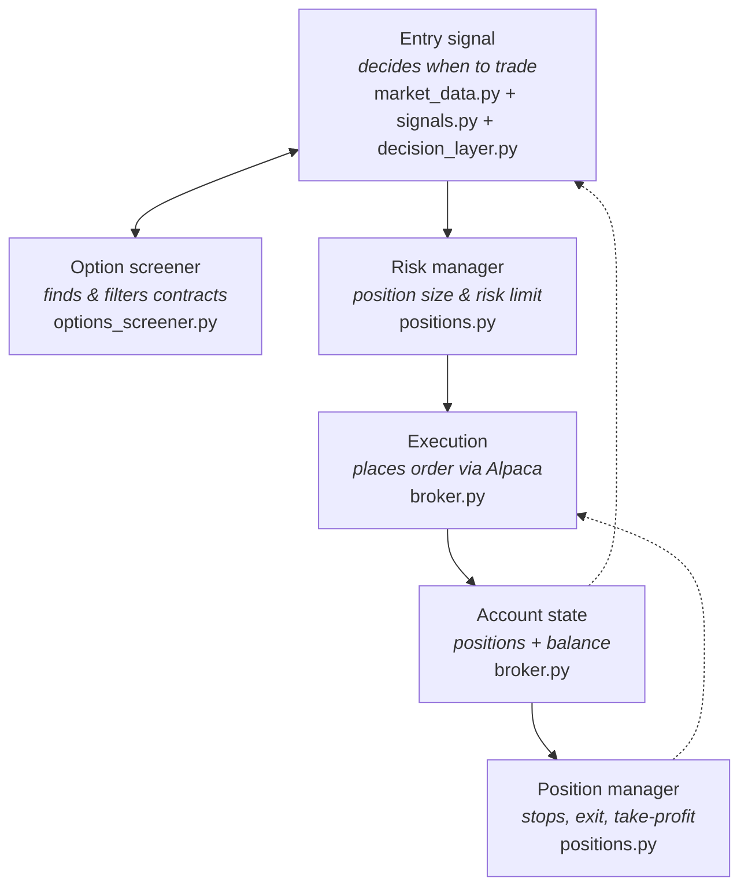

# Alpaca AI Hackathon agent — options vertical spreads (paper only)

An autonomous paper-trading agent for the **Alpaca AI Trading Agents Hackathon**
(Aug 28 – Sep 4, 2026). Every cycle it scores a **whitelist of candidate
underlyings**, lets an LLM pick at most one entry, and trades **debit vertical
spreads** as single multi-leg (MLEG) limit orders. Exits are purely mechanical.

> **Full rewrite (2026-08-31).** The previous phased single-underlying package
> (`src/regimepilot/`) was replaced with 7 flat modules. The old code lives in
> git history.

## Architecture



Each box in the diagram is one module:

| Diagram box | Module | Job |
|---|---|---|
| Entry signal (market data) | `market_data.py` | OHLCV DataFrame for one symbol at a time, any bar timeframe |
| Entry signal (analysis) | `signals.py` | RSI/ATR/MACD + event detection (gap, breakout, MACD cross) + entry gates (pure) |
| Entry signal (decision) | `decision_layer.py` | LLM (OpenRouter) — or you, with `--manual-mode` — picks ≤1 entry from the event-firing candidates |
| Option screener | `options_screener.py` | expiry pick, spread enumeration, liquidity filter, IV-skew ranking, order plans (pure) |
| Risk manager + Position manager | `positions.py` | leg pairing, mechanical exits, equity-relative sizing (pure) |
| Execution + Account state | `broker.py` | all env/Alpaca access; `submit_paper_order` is the only submitting function |
| wiring | `cli.py` | typer CLI + the cycle engine + loguru logging + JSONL journal |
| — | `models.py` | frozen dataclasses shared by everything |

## Methodology (approved 2026-08-31)

- **Whitelist** (`SYMBOLS` env): SPY, QQQ, IWM, AAPL, NVDA, TSLA, MSFT, AMZN by default.
- **Signals**: OHLCV bars at the configured `BAR_TIMEFRAME` (default 15m, one
  fetch per symbol) drive RSI(14), ATR(14) and MACD(12/26/9). A symbol is a
  candidate only when at least one **event** fired on the latest completed bar:
  gap (|open − prior close| > 2×ATR), breakout (|close − open| > 2×ATR), or the
  MACD histogram crossing zero — ATR taken as of the prior bar. Entry gates:
  market open, bars fresher than 2× bar duration, enough history for the
  indicators, quote present, event fired. Trading near the open and the close
  is allowed. A held or pending underlying is not a candidate.
- **Decision**: the LLM sees the event-firing candidates (events + RSI/ATR/MACD
  readings) and returns `{action, symbol, direction, thesis}`. Malformed output
  means no entry. Deterministic code picks everything else.
- **Spread selection**: nearest expiry (weeklies included) with **≥5 DTE**;
  candidate strike pairs within ±10% of spot, widths of 1–3 strike steps;
  per-leg filter: open interest ≥ 100, fresh two-sided quote (≤10 s vs server
  clock), leg spread ≤ 350 bps, implied volatility present; sanity
  `0.05 ≤ net debit < width`; rank by **IV skew, flattest first** (ties →
  higher combined open interest).
- **Risk (from live equity, every cycle)**: per entry ≤ 0.5% of equity, new
  premium per cycle ≤ 1%, total open premium at risk ≤ 10%. Unknown equity or
  unknown open risk refuses entries.
- **Exits (mechanical only, before entries, every cycle)**: close the spread
  when net mark ≤ −50% of entry debit, ≥ +100%, or DTE ≤ 2. The LLM is never
  consulted on exits. Entry debit comes from Alpaca's per-leg
  `avg_entry_price`, so it survives restarts.
- **Orders**: one MLEG limit order per action (entry at the fresh net debit,
  exit at the fresh net credit — negative limit per Alpaca's convention),
  time-in-force day, deterministic `client_order_id` per cycle.

## Safety rules this code enforces

- Credentials from **environment variables only**; the `Config` repr redacts them.
- Startup **aborts** on `ALPACA_PAPER != true` (strict parse), any live flag
  (`ALPACA_LIVE`, `ALPACA_LIVE_TRADING`, `APCA_LIVE`), or any endpoint variable
  pointing at `api.alpaca.markets`.
- `TradingClient` is always built with `paper=True` hard-coded.
- `broker.submit_paper_order` is the **only** function that submits, runs only
  under `run --execute`, re-validates every plan, and reports an Alpaca refusal
  as the exception type name only. Nothing cancels, replaces or exercises.
- Vendor exceptions are wrapped to type names (`from None`) so request text and
  credentials never reach logs.
- Positions that don't pair into a known debit vertical are warned about and
  **never touched**.
- Missing market data is `None` or an explicit rejection, never a substitute value.
- Unit tests make **no** network calls.

## Setup

Requires Python 3.11 and [uv](https://docs.astral.sh/uv/).

```bash
uv sync
cp .env.example .env   # then paste your PAPER keys into .env
```

`.env` is git-ignored and never read by the code itself — pass it with
`uv run --env-file .env`. Optional env: `SYMBOLS`, `BAR_TIMEFRAME`,
`OPENROUTER_API_KEY` (for LLM decisions; use `--manual-mode` without one).

## Run

```bash
uv run pytest                                   # no credentials, no network

uv run --env-file .env python cli.py account                          # account state (read-only)
uv run --env-file .env python cli.py candidates                       # scored whitelist (read-only)
uv run --env-file .env python cli.py screen SPY --direction CALL      # what spread would be picked

uv run --env-file .env python cli.py run --manual-mode                # one cycle, dry run, you pick the entry
uv run --env-file .env python cli.py run --manual-mode --execute      # one cycle, real PAPER order
uv run --env-file .env python cli.py run --execute --loop             # autonomous, LLM, every 15 min
```

`--execute` is the only way an order is submitted; the client is still
paper-only. Every cycle appends one JSON line to `logs/cycles.jsonl`
(git-ignored) as an audit journal.

Spreads require Alpaca **options trading level 3** on the paper account; the
agent checks this before arming an entry.
